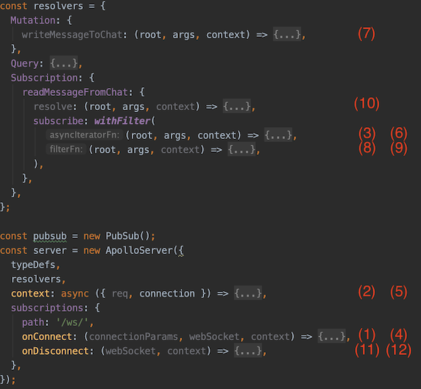
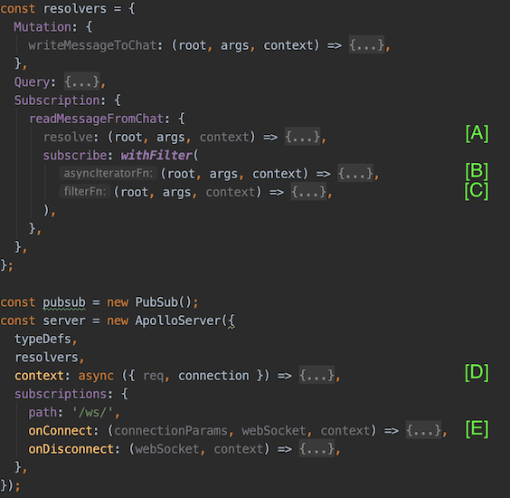

# Authentication and Authorization in Apollo GraphQL subscriptions
GraphQL subscription is an additional type of operation like query and mutation. Apollo implementation of GraphQL 
([https://www.apollographql.com/docs](https://www.apollographql.com/docs)) supports subscription.
Authentication is a process, which answer the question who user is. Authorization answers the question what user can or cannot do.

Repository contains a simple application, which simulate messenger with multiple chats. Message could be sent to chat by its ID and client
could subscribe with chat ID to receive new message from a chat. The purpose of the app is to shows a subscription life cycle in Apollo and places,
where authentication and authorization logic could be placed.

## Installation
Clone repository:
```bash
git clone git@github.com:viktor-br/gql-subscriptions-auth.git
```
switch to `gql-subscriptions-auth` folder and install dependencies:
```bash
npm install
```

## Structure of the project
[server.js](./server.js) provides primitive API for a messenger with multiple chats. Messages could be sent to or received from the server by chat ID. 

```graphql
  type Message {
    id: Int!
    chatId: Int!
    content: String!
  }

  type Query {
    readMessageById(id: Int!): Message!
  }

  type Mutation {
    writeMessageToChat(chatId: Int!, content: String!): Message
  }

  type Subscription {
    readMessageFromChat(chatId: Int!): Message!
  }
```

_client-subscribe.js_ subscribes to *readMessageFromChat* subscription to receive message from chat for a particular chat ID (by default, ID=1):
```bash
node client-subscribe.js 2
```

_client-send-message.js_ sends message to server with using _writeMessageToChat_ mutation for a particular chat ID (by default, ID=1):
```bash
node client-send-message.js 2
```

## Playing with subscriptions
Follow next steps to trigger each step of the subscription life cycle:
* run server.js
    ```bash
    node server.js
    ```
* run subscription for chat ID=1
    ```bash
    node client-subscribe.js 1
    ```
* run subscription for chat ID=2
    ```bash
    node client-subscribe.js 2
    ```
* send message to chat ID=2
    ```bash
    node client-send-message.js 2
    ```
* check in logs that only second subscription received a message  
    ```
    21:00:51 subscription:readMessageFromChat chat ID=2 { data:
        { readMessageFromChat: { id: 12345, content: '123456789', __typename: 'Message' } } }
    ```
* exit from subscription for chat ID=1 (press Ctrl+C)
* exit from subscription for chat ID=2 (press Ctrl+C)

as a result of previous steps, you'll see server.js running log:
```text
 1. 21:00:41 subscriptions:onConnect                                            
 2. 21:00:41 subscription:readMessageFromChatResolver:subscribe() asyncIterator
 3. 21:00:45 subscriptions:onConnect                                            
 4. 21:00:45 subscription:readMessageFromChatResolver:subscribe() asyncIterator
 5. 21:00:51 mutation:writeMessageToChat:resolve()                              
 6. 21:00:51 subscription:readMessageFromChatResolver:subscribe() filter 1 2                                     
 7. 21:00:51 subscription:readMessageFromChatResolver:subscribe() filter 2 2    
 8. 21:00:51 subscription:readMessageFromChatResolver:resolve() 2               
 9. 21:01:02 subscriptions:onDisconnect                                         
10. 21:01:04 subscriptions:onDisconnect                                         
```
Next image shows the order of calls. Red markers are numbers of the server.js log lines. 



The subscription life cycle is simple: 
* onConnect (markers 1 and 3), when client tries to open websocket connection 
* asyncIteratorFn (markers 2 and 4), when client tries to create subscription
* filterFn (markers 6 and 7), when message comes via pubsub
* resolve (marker 8), if subscription for a particular chat matched a message
* onDisconnect (marker 9 and 10), when client closes connection.

## Authentication and Authorization
Depend on requirements, authentication and authorization could be joined or separated. If user always can read chat, no need in authorization at all.
But if user can be kicked out of the chat at any time and cannot read chat any more, we need to authorize user all the time.

Image below is a [server.js](./server.js) code with markers for places, where authentication and authorization logic could be used. 



Apollo documentation has an example of authentication over webSocket 
[https://www.apollographql.com/docs/apollo-server/data/subscriptions/#authentication-over-websocket](https://www.apollographql.com/docs/apollo-server/data/subscriptions/#authentication-over-websocket)
in onConnect method (marked with letter E).
In case you have unified authentication for query/mutation and subscription, you can place authentication logic in context creation (marked with 
letter D).

Websocket connection could be long-lived, so in case of strict requirements for an authorization, we cannot rely on onConnect call or context 
creation.

Authorisation result could be cached, but it's separate topic.

First place, where we can put authorization logic is asyncIteratorFn (marked with letter B). We just check permissions, when create subscription, 
but subscription also could be belong lived as a websocket itself and operates till client's unsubscribe call (or server shutdown). 
There is another issue with authorisation in subscribe: for now (September 2019), if subscription still in opening phase and client calls unsubscribe, 
subscription stays active inside Apollo. I created separate repository with a code to reproduce the issue 
[https://github.com/viktor-br/subscriptions-transport-ws-reproduce-issue](https://github.com/viktor-br/subscriptions-transport-ws-reproduce-issue) 
(and an issue in lib repository https://github.com/apollographql/subscriptions-transport-ws/issues/645). 

Next place is a filterFn (marked with letter C), but this function will be called for each
subscription, which means we need to check permissions for all connected users and definitely waste resources.

Last place is a resolver itself (marked with letter A), which will be called when all subscriptions for other chat IDs already filtered out and server 
sends message to a client. But if filter is not used and resolve will be invoked for every subscription, then no difference with previous case and 
on any incoming message authorisation will be triggered.

## Conclusion
When authorization should be called (and how) totally depends on requirements. Resolve method (marked with A) looks like a better
place in general, b/c it allows check permission just before send message to end user. 


